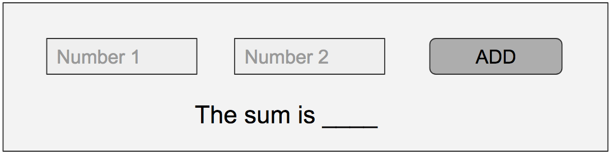

# DOM Manipulation Exercises

### Task 1:

**After the HTML document loads, print the text of the first heading in the console.**

------

### Task 2:

**In the HTML view:**

a. Add a button, which when clicked adds a 'p' element with text 'Hello World' to the given 'div'

b. Add two buttons for red and green, clicking each changes the background color to the respective color

c. Add a button, that redirects the page to Google

------
### Task 3:

**Add jQuery to the HTML document.**

------

### Task 4 - Use jQuery

**In the HTML view:**

a. Add a button, which when clicked adds a ‘div’ with text “Hello World”

b. Add two buttons for red and green, clicking each changes the background color to the respective color

c. Add two input elements, and a button that allows to add two numbers and shows the result on the screen.

------
